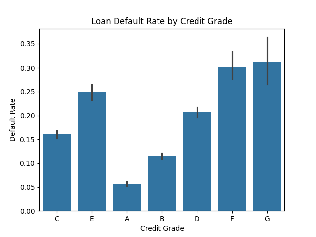
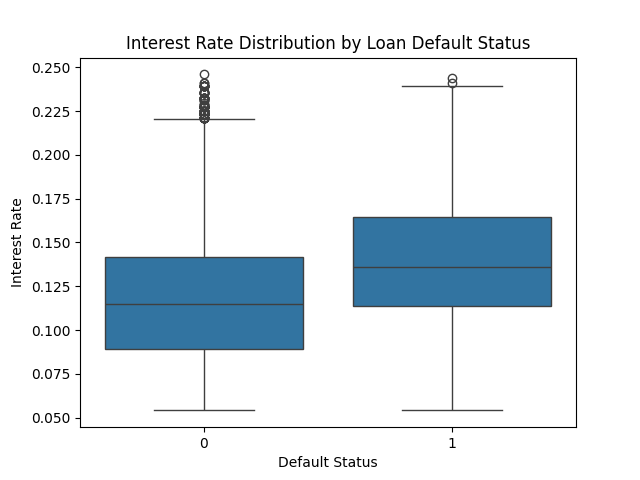
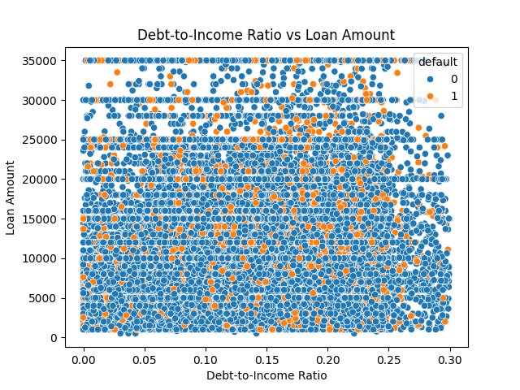
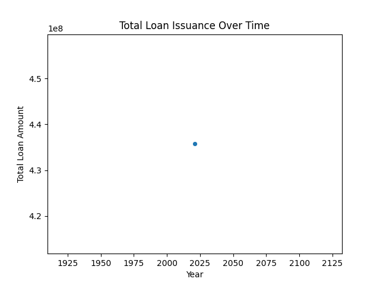
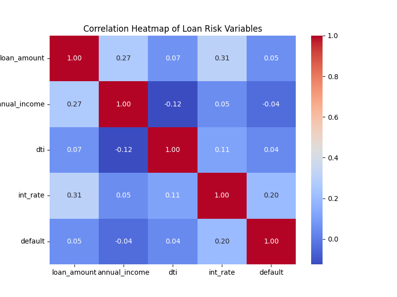
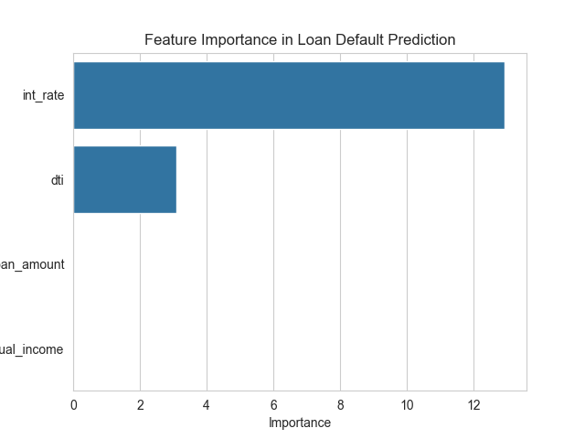

# Loan-Default-Prediction
This project analyzes retail loan data to identify key indicators of borrower default. By employing Logistic Regression, I built a classification model to assess risk and provide actionable insights for credit underwriting. This project analyzes a financial lending dataset containing over 38,000 loans to understand the determinants of loan default. The analysis combines: Data cleaning and preprocessing, Exploratory data analysis, Statistical visualization, and Logistic regression modeling
## Objectives
The objective is to identify drivers of loan default and evaluate predictive capability.

# Tools & Technologies
Python
Pandas
NumPy
Seaborn
Matplotlib
Scikit-learn

# Key variables analyzed
Loan Amount
Annual Income
Debt-to-Income Ratio (DTI)
Interest Rate
Credit Grade
Loan Status
A binary variable default was created:
0 → Fully Paid
1 → Charged Off

# Data Cleaning
Key preprocessing steps performed in Python:
• Converted interest rates from percentage strings to numeric values
• Filled missing annual income using the dataset median
• Standardized date columns using pandas datetime conversion
• Removed duplicate observations
• Created a binary default indicator from loan_status
These steps ensure the dataset is consistent for statistical analysis and machine learning.

## Exploratory Analysis & Visualizations
# Default Rate by Credit Grade
This bar chart shows the average default rate across borrower credit grades.

Statistically, the bar height represents the mean of the binary default variable within each grade category.
Interpretation:
Lower credit grades exhibit significantly higher default rates.
Borrowers in grades E, F, and G show the greatest probability of default.
This confirms that credit scoring is strongly associated with loan risk.

# Interest Rate Distribution by Default Status
A boxplot compares interest rate distributions between performing and defaulted loans.

Statistical interpretation- The box represents the interquartile range (25th–75th percentile. The horizontal line inside the box represents the median interest rate. Points outside the whiskers represent extreme values
Financial insight- Loans that default tend to have higher interest rate distributions, reflecting lenders’ risk-based pricing strategies. Higher borrowing costs may also contribute to repayment difficulty.

# Debt-to-Income Ratio vs Loan Amount
This scatter plot visualizes the relationship between borrower leverage and loan size. Each point represents a borrower, with color indicating default status.

Observation:
Borrowers with higher debt-to-income ratios show greater clustering of default outcomes. DTI is therefore a key indicator of repayment capacity.

# Loan Issuance Over Time
A time series visualization tracks the total loan amounts issued per year. This reveals lending activity trends and how the volume of credit extended changes over time.

# Correlation Analysis
A correlation matrix was computed using: Loan Amount, Annual Income, Debt-to-Income Ratio, Interest Rate, Default. 

Key findings show that Interest Rate shows positive correlation with default risk. Debt-to-Income ratio also exhibits a positive relationship with default. Income displays a weaker negative relationship, indicating higher-income borrowers are somewhat less likely to default.

# Predictive Model
A Logistic Regression model was implemented to estimate the probability of borrower default. Features includes Loan Amount, Annual Income, Debt-to-Income Ratio, Interest Rate Target variable: Default (0 or 1)

Logistic regression coefficients were analyzed to determine the most influential predictors of loan default. Loans with higher interest rates are much more likely to default. This makes sense because lenders often charge higher interest to riskier borrowers. Also, borrowers with higher debt relative to their income have a higher probability of default. This is one of the most important indicators used in lending decisions. However, the size of the loan alone does not strongly determine default risk in this dataset.
Thus, Interest rates emerged as the strongest predictor, followed by the borrower's debt-to-income ratio. Annual income showed a small negative relationship with default probability, indicating that higher-income borrowers are slightly less likely to default.

# ML Model
Train-Test Split- The dataset was divided using: train_test_split(X, y, test_size=0.3, random_state=42)
This created 70% training data → used to train the model, 30% testing data → used to evaluate performance
This approach ensures the model is tested on unseen data.

- Model Performance
Accuracy: ≈ 86%

# Confusion Matrix 
The confusion matrix summarizes prediction outcomes. Interpretation:
True Negatives
Loans correctly predicted as non-default.
True Positives
Loans correctly predicted as default.
False Positives
Safe borrowers incorrectly flagged as risky.
False Negatives
Defaulting borrowers incorrectly predicted as safe.
In traditional lending models, false negatives are particularly costly because they represent loans that default unexpectedly. Thus, Feature Model coefficients indicate the relative influence of each variable on default probability.

### Key result:
Interest Rate → strongest predictor of default
Debt-to-Income Ratio → second strongest predictor
Loan Amount and Income show smaller effects
This suggests that loan pricing and borrower leverage are primary drivers of credit risk.

## Key Insights frok this analysis
- Higher debt-to-income ratios increase default probability.
- Lower credit grades show significantly higher default rates.
- Loans with higher interest rates are more likely to default, reflecting risk-based pricing.
- Borrower financial capacity plays a critical role in loan repayment outcomes.

# Techniques used:
Data cleaning with Pandas
Exploratory Data Analysis
Data visualization
Logistic regression modeling
tools used (for clarity)
- Python
- Pandas
- seaborn
- scikit_learn

## Data Sources
Kaggle

## Author
Josephine Opene-Terry
